# 6기 2학기 공통PJT(22/01/3 ~ 22/02/18)

## 광주 1반 3팀 워라벨팀(C103)

### 프로젝트 주제

- [해줘잉](https://i6c103.p.ssafy.io)

### 팀원 및 역할

#### Front 

> 기술 스택
>
> > React, node.js

- 채성원

- 허영민

- 정정채

#### Back 

> 기술 스택
>
> > Spring boot, docker

- 정재현

- 한윤희
- 이은성

# Process

# 기획

## 프로젝트 기획

<ul>
  <li>E-R Diagram</li>
  

    
  

  <li>Wireframe</li>
  

    
  

  <li>Swagger API Document</li>
  

    
    
    
    
    
  

</ul>

## 빌드 및 배포
<ul>
  <li>
    <b>사용한 JVM, 웹서버, WAS 제품  등의 종류와 설정값, 버전(IDE 버전 포함)</b>
    <ul>
      <li>JVM : Java 11</li>
      <li>통합개발환경(IDE) : 인텔리제이 3.1 (Back-end), VSCode 1.63.2 (Front-end)</li>
      <li>웹서버 : 로컬(http://localhost:8080, http://i6c103.p.ssafy.io)</li>
      <li>WAS : SpringBoot 내장 톰캣</li>
    </ul>
  </li>
  <li>
    <b>배포 아키텍쳐</b>
    

      
    

  </li>
  <li>
    <b>포트 번호</b>
    
[Front-end] : 3000

    
[Back-end] : 8080

    
[Database] : 3306

​    <b>Version</b>
    <ul>
      <li>[Front-end] : eact 17.0.2 , react-bootstrap 2.1.1, style-component 5.3.3 , web-vitals 2.1.3</li>
      <li>[Back-end] : 웹서버 : SpringBoot 2.5.9, Java : 11.0.13, jwt auth, Spring Security</li>
      <li>[Database] : mybatis 2.2.1 mysql 8.0.28</li>
      <li>[OS, Server] : Ubuntu 20.04, Nginx 1.18.0, AWS S3
    </ul>
  </li>
  <li>
    
Nginx

    
nginx 설정(/etc/nginx/siteds-enabled/default

    

      
    

  </li>
  <li>
    <b>서버 세팅</b>
    

      
    

  </li>
  <li>
    <b>Front-end</b>

    

      
    

​    <b>Back-end</b>

    

      
    

# Front-End

### React 기반 개발

- CSS module 과 Styled Component를 사용하여 각자 스타일대로 CSS 컴포넌트 구성

  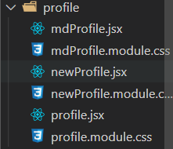

  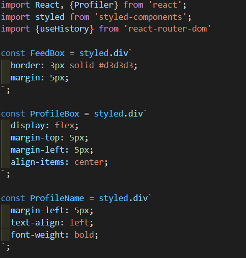

  

- React-redux 를 사용하여 Alarm 데이터를 저장 및 사용을하고 추후에 더 다양한 곳에 사용할 예정

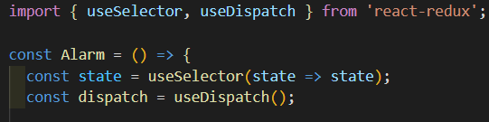

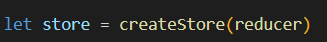

- Component 간에 Props 를 이용하여 Component 재사용성을 늘림

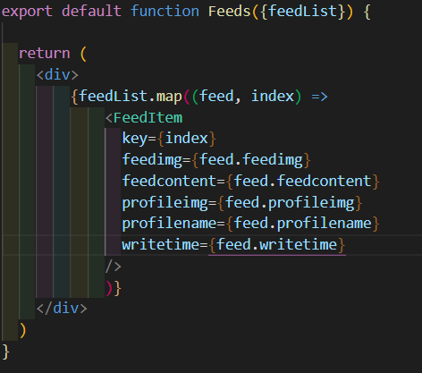

- React-router-dom 으로 페이지를 구성. 추후에 Next.js 를 학습하면 적용할 수도 있음

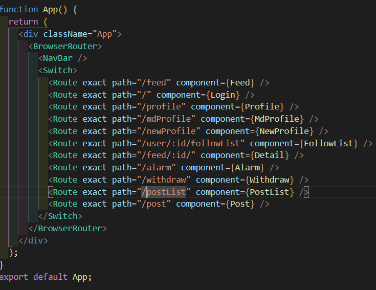

- React Hook 을 이용하여 CRUD, Infinite Scroll등 다양한 기능들을 구현

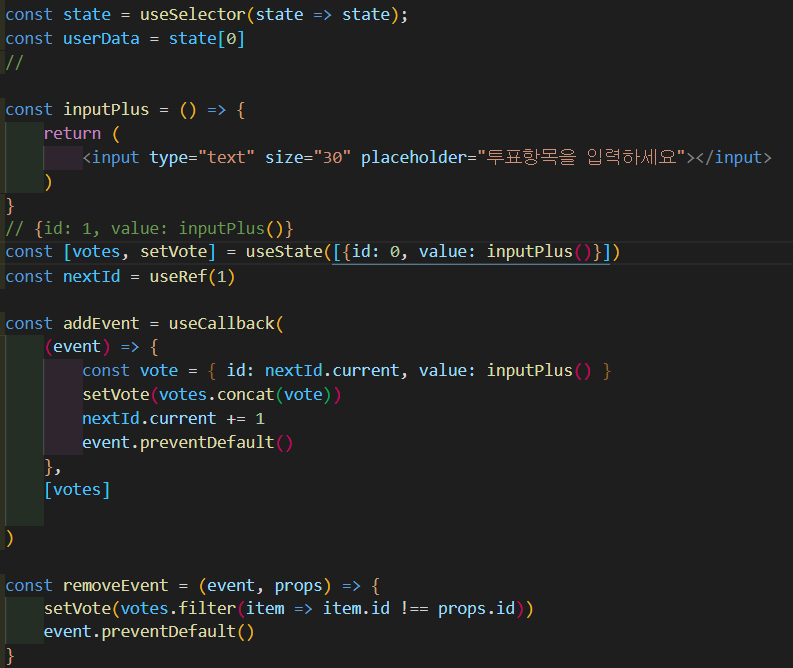

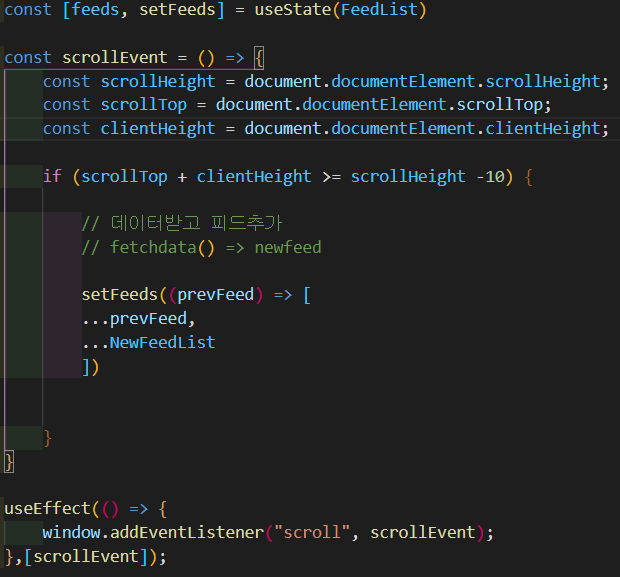

- 소셜로그인 라이브러리를 이용하여 OAuth를 통한 소셜로그인 구현

  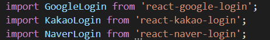

  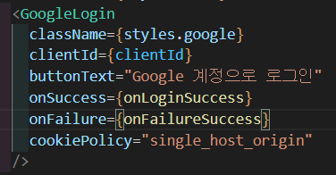

  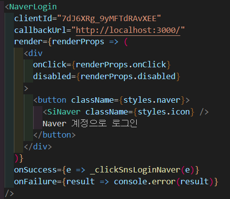

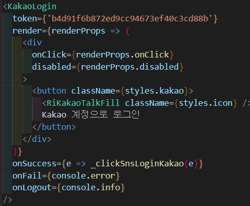

# Back-End

### Spring boot 기반 개발

- controller

